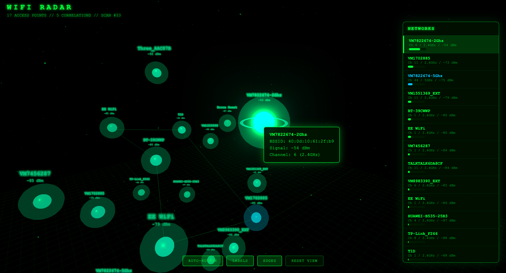

# WiFi Radar

A real-time 3D Matrix-style WiFi network visualizer. Displays nearby WiFi access points as glowing nodes in an interactive 3D scene, with correlated networks clustering together.



## Quick Start

```bash
pip3 install numpy websockets
python3 wifi_radar.py
```

That's it. A browser window opens with the 3D visualization using synthetic demo data.

## Features

- **3D Force-Directed Layout** — Networks spread out in 3D space based on signal correlation
- **Pearson Correlation Clustering** — APs whose signal strengths rise and fall together are grouped as likely co-located
- **Matrix Rain Aesthetic** — Digital rain, bloom effects, glowing nodes
- **Interactive Controls** — Click nodes to select, hover for details, orbit/zoom the camera
- **Side Panel** — Lists all networks sorted by signal strength with RSSI bars
- **Band Color Coding** — Green for 2.4GHz, cyan for 5GHz
- **Toggle Controls** — Auto-rotate, labels, edges, reset view

## Live WiFi Scanning (macOS)

To scan real WiFi networks instead of demo data:

```bash
pip3 install pyobjc-framework-CoreWLAN
python3 wifi_radar.py --live
```

**Requirements for live mode:**
- macOS only (uses CoreWLAN framework)
- Location Services must be enabled for Terminal in System Settings > Privacy & Security > Location Services

## Controls

| Action | Description |
|--------|-------------|
| **Click node** | Select/deselect — highlights connections |
| **Click side panel** | Select network and fly camera to it |
| **Hover node** | Show tooltip with details + correlations |
| **Drag** | Orbit camera |
| **Scroll** | Zoom in/out |
| **AUTO-ROTATE** | Toggle camera auto-rotation |
| **LABELS** | Toggle network name labels |
| **EDGES** | Toggle correlation edge lines |
| **RESET VIEW** | Return camera to default position |

## How It Works

1. **Scanning** — Every few seconds, WiFi networks are scanned (or simulated in demo mode)
2. **RSSI Tracking** — Signal strengths are recorded over time per access point
3. **Correlation** — Pearson correlation is computed between RSSI time-series of all AP pairs
4. **Layout** — A force-directed algorithm positions nodes in 3D: correlated APs attract, uncorrelated ones repel
5. **Rendering** — Three.js renders the scene with bloom post-processing, particle rain, and glow effects

## Dependencies

- `numpy` — Correlation computation and layout math
- `websockets` — Real-time data push to browser
- `pyobjc-framework-CoreWLAN` — *(optional, macOS only)* Live WiFi scanning
